## AgentPlayground · 多范式 Agent 实践项目

从零手写的 Agent 实践项目：**3 种经典 Agent 范式**，以及一个具备 **RAG 知识库 / 跨会话长期记忆 / MCP 远程工具** 的多轮对话聊天助手。

---


### 架构总览

```mermaid
flowchart TD
    U[用户] --> M[main.py 交互式控制台]
    M --> A1[ReActAgent]
    M --> A2[PlanAndSolveAgent]
    M --> A3[ReflectionAgent]
    M --> A4[ChatAgent]
    A1 & A3 & A4 --> L[LLMClient] --> LLM[DeepSeek API]
    A1 & A3 & A4 --> TM[ToolManager]
    TM --> MT[MCP tool client] --> MSRV[MCP Server] --> TV[Web Search]
    TM --> MQ[memory_query] & MA[memory_add] --> MST[MemoryStore]
    TM --> RQ[rag_query] --> RST[RagStore]
    MST & RST --> VS[VectorStore 基类] --> DB[DbConnection]
    VS --> EM[Embedder]
    RST --> RR[Reranker]

    classDef entry fill:#FCE4EC,stroke:#C2185B,stroke-width:2px,color:#880E4F
    classDef paradigm fill:#E8F5E9,stroke:#2E7D32,stroke-width:2px,color:#1B5E20
    classDef capability fill:#FFF3E0,stroke:#EF6C00,stroke-width:2px,color:#E65100
    classDef knowledge fill:#E3F2FD,stroke:#1565C0,stroke-width:2px,color:#0D47A1
    classDef infra fill:#F3E5F5,stroke:#6A1B9A,stroke-width:2px,color:#4A148C
    classDef external fill:#E0F7FA,stroke:#00838F,stroke-width:2px,stroke-dasharray:5 3,color:#006064

    class M entry
    class A1,A2,A3,A4 paradigm
    class TM,MT,MQ,MA,RQ capability
    class MST,RST,VS knowledge
    class L,LLM,DB,EM,RR infra
    class MSRV,TV external
```




---


### 目录结构

```
AgentPlayground/
├── main.py                 # 统一入口：启动 Agent 
├── agent/
│   ├── core/               # agent.py(基类) config.py(单例) message.py(对话消息) agent_response.py(统一响应) memory_item.py(记忆条目)
│   ├── react_agent.py              # ① 推理 + 行动
│   ├── plan_and_solve_agent.py     # ② 先规划后执行
│   ├── reflection_agent.py         # ③ 自我反思
│   └── chat_agent.py               # ④ 多轮对话助手
├── llm/                    # llm_client.py + llm_response.py
├── tools/
│   ├── tool.py             # Tool 抽象基类
│   ├── tool_manager.py     # ToolManager 注册 / 发现 / 执行 
│   └── builtin/            # mcp_tool memory_tool rag_tool
├── memory/                 # memory_store.py(记忆添加+检索) + memory_manager.py(维护后台)
├── rag/
│   ├── rag_store.py(知识库添加+检索)
│   ├── document_preprocess/  # document_parser(文档解析) text_splitter(文本递归切分) rag_manager(管理后台)
│   └── docs/               # 原始文档（PDF / MD / TXT）
├── database/               # db_connection(单例) vector_store(基类) 
└── mcp_server/             # mcp_server.py
```

---


### 四种 Agent 范式

| Agent | 机制 | 关键设计 |
| :--- | :--- | :--- |
| **ReActAgent** | 思考 → 行动 → 观察，循环至信息足够 | 支持一轮内并行调多个工具；达最大步数后不再传工具，强制收尾 |
| **PlanAndSolveAgent** | Planner 设计步骤 → Executor 逐步执行 → Synthesizer 合成 | 计划 JSON 输出、超限截断；某步为空即熔断，避免污染后续 |
| **ReflectionAgent** | Executor 写草稿 → Reviewer 批评 → 修订迭代 | 每轮 `reset()` 隔离任务状态；只保留最新稿，避免旧稿与新反馈冲突 |
| **ChatAgent** | 对话 + 工具 + 三层记忆 | 见下方链路 |

**ChatAgent 单轮链路**：

```
用户输入
  ├─ messages = system 提示词 + 会话历史 + 本轮输入
  ├─ 第一轮 LLM：无工具调用 → 直接作答
  │                  有工具调用(memory_query、rag_query、search) → 执行工具 → role="tool" 回传 
  ├─ 第二轮 LLM → 作答
  ├─ 回答写入会话历史 → 按 token 预算裁剪
  └─ _remember()：本轮对话交互过程（用户问题+工具结果+Agent答复）抽取并写入跨会话记忆
```

---


### 项目亮点

- **三种经典Agent范式 + 一个多轮聊天Agent，统一入口**：同一进程内切换体验 ReAct / Plan-and-Solve / Reflection / ChatAgent，全部返回统一的 `AgentResponse`。
- **原生 Function Calling**：工具调用使用OpenAI原生接口，并通过 `tool_choice`，由模型自主决策，不靠程序逻辑判断。
- **MCP 工具自动发现**： 任何遵循MCP协议的通用服务都能即插即用，无需为每个服务单独写适配代码。启动Agent时通过 `list_tools()` 把MCP Server中的工具批量包装成本地 `Tool` 契约，新增能力只需在 Server 加一个 `@mcp.tool()`。
- **ChatAgent 三层信息供给**：本轮会话历史（内存）/ 跨会话长期记忆（向量库）/ RAG 本地知识库，职责不重叠、优先级明确。
- **记忆分类及防幻觉**：框架侧独立 LLM 负责抽取 → Pydantic 强校验 → **evidence 逐字溯源**（原文对不上即丢弃）；并按 `source_type` 选择记忆的不同生命周期策略（偏好/事实 `overwrite`，快照/纪要 `append`）。
- **RAG 两阶段检索**：MarkItDown 解析 → 递归切分（参数对齐 embedding 512 token 上限）→ embedding（BAAI/bge-large-zh-v1.5） 召回 → bge-reranker 精排，重排失败自动降级。

设计风格：

- **抽象基类 / 契约驱动**：`Agent`、`Tool`、`VectorStore` 只定义契约，子类只实现差异。
- **适配器模式**：`MCPTool` 把远程 MCP 函数翻译成本地 `Tool` 契约，上层零感知。
- **单例模式**：`config`、`db_connection`、`tool_manager`、`memory_store`、`rag_store` 全局只实例化一份，模块导入即就绪。
- **分层**：入口层(main) → 范式层(agent) → 工具层(tools/mcp) → 记忆与知识层(memory/rag) → 基础设施层(database/llm)。


---


### 快速开始

#### 1. 安装依赖

需要在 **Python 3.10+** 环境下运行

```bash
pip install -r requirements.txt
```

#### 2. 配置 `.env`

重点填写：

```dotenv
# LLM
LLM_API_KEY=
LLM_BASE_URL=
REACT_AGENT_MODEL=
PLANNER_MODEL=
EXECUTOR_MODEL=
REFLECTION_EXECUTOR_MODEL=
REFLECTION_REVIEWER_MODEL=
CHAT_AGENT_MODEL=
MEMORY_MODEL=

# Embedding
EMBEDDING_API_KEY=
EMBEDDING_BASE_URL=
EMBEDDING_MODEL=

# RAG 检索
RAG_RERANK_API_KEY=
RAG_RERANK_BASE_URL=
RAG_RERANK_MODEL=

# 网页搜索（MCP Server 使用）
TAVILY_API_KEY=
```

> 其余各项不配置则使用默认值。

#### 3. 启动 MCP Server

```bash
python mcp_server/mcp_server.py     # 监听 http://127.0.0.1:8010/mcp
```

> 未启动时 `ToolManager` 会打印警告并自动跳过 MCP 工具，其余功能不受影响。

#### 4. 构建 RAG 知识库（可选）

把文档放进 `rag/docs/` 后：

```bash
python -m rag.document_preprocess.rag_manager --index      # 一键建库
python -m rag.document_preprocess.rag_manager --list       # 查看已入库文档
python -m rag.document_preprocess.rag_manager              # 交互式管理菜单
```

#### 5. 启动主程序（必须在项目根目录执行）

```bash
python main.py
```

```
[1] ReAct Agent           🤖 推理+行动：边思考边调用工具获取信息
[2] Plan-and-Solve Agent   🧩 先规划后执行：分解任务为步骤再逐步执行
[3] Reflection Agent       🔁 自我反思：生成草稿由审阅者批评并修订迭代
[4] Chat Agent             💬 多轮聊天+记忆助手：结合长期记忆与工具连续对话
[0] 退出程序
```

选 **1/2/3**：输入一条任务 → 执行 → 返回菜单；选 **4**：进入多轮对话，输入 `exit` / `quit` / `退出` 返回菜单。

#### 其它辅助入口

```bash
python -m memory.memory_manager            # 长期记忆维护：查看 / 清空 agent_memory
python tools/tool_manager.py               # 查看所有已注册工具及其 Schema，并逐个试跑
python mcp_server/mcp_test.py              # MCP 连通性测试
```

---


### 常见问题

* **必须用 `python main.py` 在根目录运行？** 是的，项目使用包内绝对导入，根目录需在 `sys.path` 中；
子模块可以用 `python -m xxx.yyy` 运行。

* **提示 MCP 工具同步失败？** MCP Server 需要先启动。不启动程序也不会崩，只是 `search` 工具不可用。

* **`rag_query` 查不到内容？** 若知识库为空，执行 `python -m rag.document_preprocess.rag_manager --index` 建库。

* **LLM、Embedding模型不可用？** 检查 `.env` 中的配置是否正确。

---


### 致谢

- 课程与设计灵感：[Datawhale · Hello-Agents](https://hello-agents.datawhale.cc/)
- 开源项目：[datawhalechina/hello-agents](https://github.com/datawhalechina/hello-agents)
- 第三方工具：[Chroma](https://www.trychroma.com/)、[MCP](https://modelcontextprotocol.io/)、[MarkItDown](https://github.com/microsoft/markitdown)、[Tavily](https://tavily.com/)

再次感谢 Datawhale 与 Hello-Agents，本项目仅为个人学习实践成果。